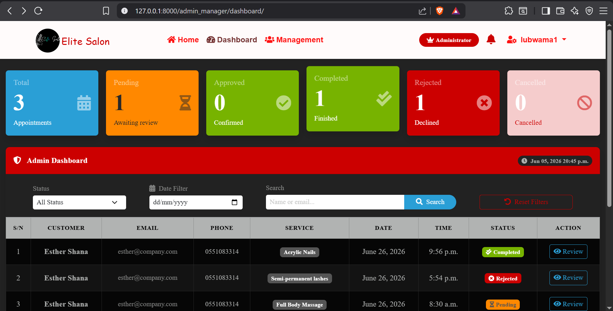
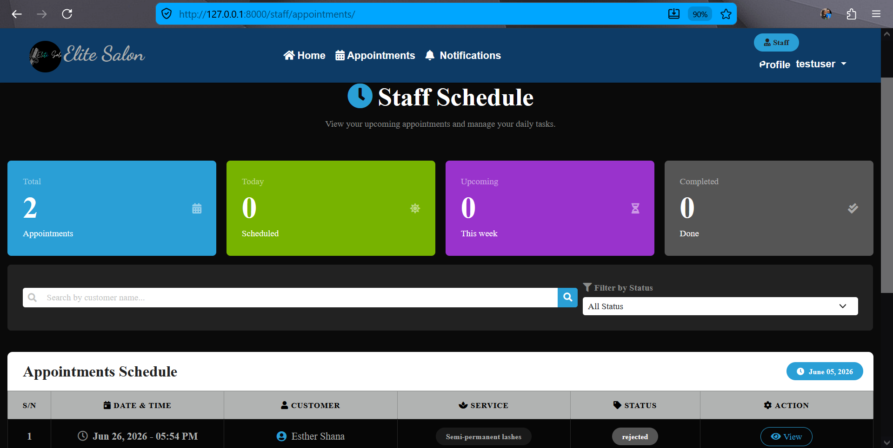
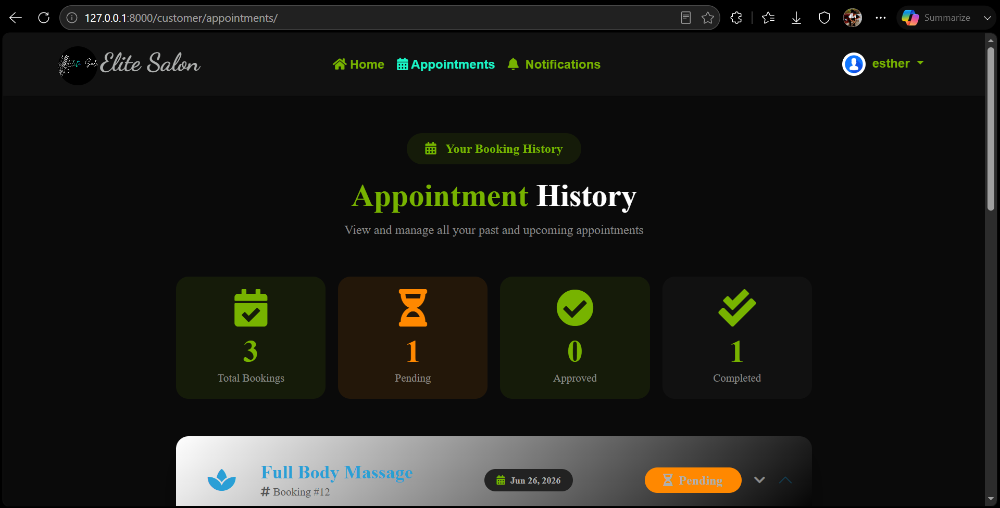

# 💇‍♂️ Elite Saloon Management System

---

## ✨ Overview

A full-featured **salon management system** built with Django.
It manages salon services, bookings, staff schedules, customer interactions, and real-time notifications in a modern web interface.

---

## 🚀 Features

### 👤 Authentication System
- User registration & login
- Role-based access (Admin, Staff, Customer)
- Profile management

---

### 💈 Services Management
- Add, update, delete services
- Categories (haircut, beard, spa, etc.)
- SEO-friendly URLs (slug-based)

---

### 📅 Booking System
- Book salon services online
- Track booking status (pending, approved, completed, cancelled)
- Cancel or update appointments
- Admin approval system

---

### 🧑‍💼 Staff Management
- Staff profiles
- Work schedules & availability
- Assigned appointments
- Appointment history per staff member
- Performance tracking (completed services)

---

### 🙋‍♂️ Customer Features
- Personal dashboard
- View booking history
- Track upcoming appointments
- Submit reviews and ratings

---

### ⭐ Reviews & Ratings
- Rate completed services
- Leave feedback/comments
- Average rating per service
- Improve service quality through feedback

---

### 🔔 Notifications System
- [x] Booking alerts & status updates

- [] Real-time notifications (Django Channels)
- [] AJAX updates (no page reload)

---

### 🧑‍💻 Admin Dashboard
- Full system control
- Manage users, staff, services, bookings
- Approve or reject appointments
- Monitor reviews and activity

---

### 🎨 Frontend UI
- Responsive design (mobile + desktop)
- Bootstrap 5 UI components
- Modern card layouts
- Smooth animations

---

### 🔍 SEO Optimization
- Slug-based URLs
- Meta tags for services
- Sitemap integration
- Schema.org structured data

---

## 🛠️ Tech Stack

| Layer        | Technology |
|-------------|------------|
| Backend      | Django (Python) |
| Frontend     | HTML, CSS, Bootstrap, JavaScript |
| Database     | PostgreSQL |
| Real-time    | Django Channels (WebSockets) |
| Async        | AJAX |

---

## 📁 Project Structure
elite_saloon/
│
├── admin_manager/
├── core/
├── customer/
├── feedback/
├── notifications/
├── services/
├── site_settings/
├── staff/
├── users/
└── static/

---

## 📌 Future Improvements
- 💳 Payment integration (Stripe / mobile money)
- 📱 SMS & email notifications
- 📊 Advanced analytics dashboard
- 🧠 AI-based appointment suggestions
- 🎯 Loyalty & rewards system

---

## 📸 Screenshots
### 🧑‍💻 Dashboard

### 🧑‍💼 Staff  Schedule

### 🙋‍♂️ Customer Appointment History

---

## 👨‍💻 Author

**RAYN CODES (Dickson)**
Self-taught Django Developer 🚀
Passionate about backend systems, automation, and clean UI design.

---

## ⭐ Show Your Support
If you like this project, consider giving it a ⭐ on GitHub!

---

## MIT License
Copyright (c) 2026 **Lubwama Dickson**

